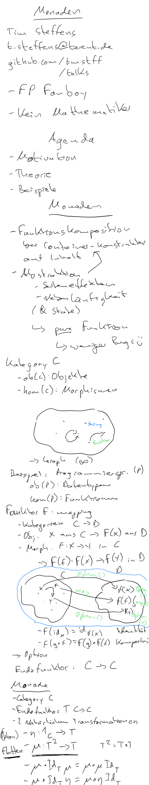

# 2020-12 Monaden – und was die .map() Funktion damit zu tun hat @Tech-Friday tarent

* [https://tech-friday.tarent.de/](https://tech-friday.tarent.de/)

## Abstract

Die meisten Entwickler haben heutzutage schon mit Monaden gearbeitet, häufig ohne es zu wissen. Ein prominentes Beispiel dafür ist die map()-Funktion, die es in vielen Sprachen für Listen, Streams oder Observables gibt. Wir schauen uns die theoretischen Grundlagen und verschiedene Beispiele an, um zu dem Schluss zu kommen dass Monaden gerade in der funktionalen Programmierung einfach der Ober-Hammer sind 😉

## Scribbling

## Demos

* Monad Example (Adress Service)
    * [demo.sc](demo.sc)
* Functor Example
    * [theorie.sc](theorie.sc)
* Animal Chip Number Example
    * [chip_number.sc](chip_number.sc)
    * [chip_number.go](chip_number.go)
    * [chip_number_future.sc](chip_number_future.sc)
* Price Example
    * [price.sc](price.sc)
    * [price.go](price.go)

## Links

* [Category Theory lecture](https://www.youtube.com/playlist?list=PLbgaMIhjbmEnaH_LTkxLI7FMa2HsnawM_) by [Bartosz Milewski](https://bartoszmilewski.com/)